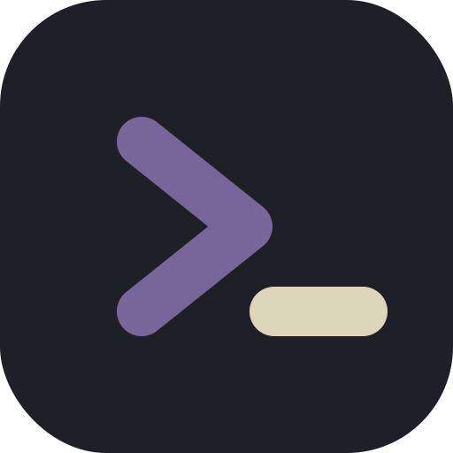

# My-Dev-Portfolio



> **Краткое описание:** Мой персональный портфолио-сайт Python backend-разработчика. Тёмная тема Kanagawa, шрифт JetBrains Mono, GitHub-style карточки проектов. 🌐 Вживую: [Shayden.ru](https://shayden.ru).

## 🛠 Стек

| Слой      | Технология                  |
| --------- | --------------------------- |
| Framework | Next.js 16 (App Router)     |
| UI        | shadcn/ui + Base UI         |
| Стили     | Tailwind CSS v4             |
| Иконки    | Lucide React                |
| Шрифты    | JetBrains Mono + Inter      |
| Язык      | TypeScript                  |
| Деплой    | Docker + собственный сервер |

## 🗄 Структура проекта

```
my-dev-portfolio/
├── app/
│   ├── globals.css        # Kanagawa-тема, CSS-переменные, анимации
│   ├── layout.tsx         # Метаданные, шрифты, viewport
│   └── page.tsx           # Сборка всех секций
│
├── components/
│   ├── header.tsx         # Навигация, переключатель RU/EN, мобильное меню
│   ├── hero.tsx           # Главный экран с анимациями
│   ├── tech-stack.tsx     # Сетка технологий
│   ├── projects.tsx       # GitHub-style карточки проектов
│   ├── contact.tsx        # Контакты и футер
│   └── ui/
│       └── button.tsx     # shadcn Button
│
├── public/                # Статика (SVG-фавикон)
├── Dockerfile
├── docker-compose.yml
└── next.config.mjs
```

## 💻 Запуск локально

### 📖 Требования

- **Node.js** 20+
- **pnpm** (рекомендуется)

```bash
npm install -g pnpm
```

### Установка и запуск

```bash
# Клонировать репозиторий
git clone https://github.com/Sh1yden/My-Dev-Portfolio.git
cd My-Dev-Portfolio

# Установить зависимости
pnpm install

# Запустить dev-сервер
pnpm dev
```

Открыть: [http://localhost:3000](http://localhost:3000/)

### Сборка для продакшена

```bash
pnpm build
pnpm start
```

## 🐳 Docker

```bash
# Собрать и запустить
docker compose up -d --build

# Остановить
docker compose down
```

> Контейнер ожидает внешнюю Docker-сеть `internet_bridge`.
> Создать её можно командой: `docker network create internet_bridge`

## 🗄 Архитектура

Полностью статичный SPA без бэкенда и API-запросов.
Все данные (проекты, стек, контакты) — TypeScript-объекты прямо в компонентах.

```
Next.js App Router
  ├── Server Components  — layout, page (SEO, метаданные)
  └── Client Components  — header (язык, мобильное меню), hero (анимации)
```

## 💜 Вопросы, контакты / FAQ

Для вопросов и предложений создавайте Issues в репозитории или же пишите в телеграмм который указан в профиле.

PS Любой помощи или совету буду очень благодарен.
